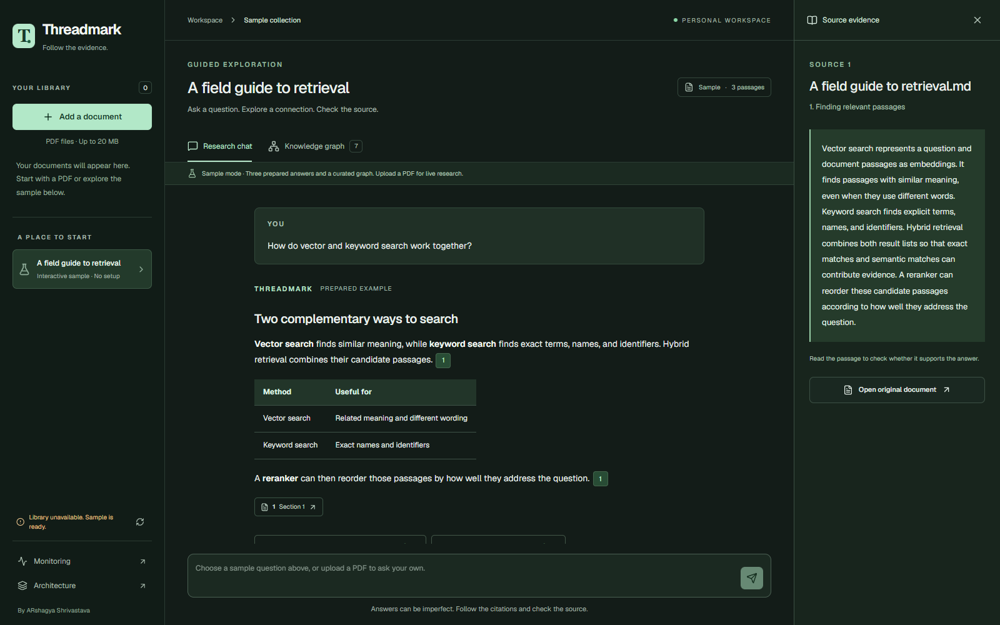
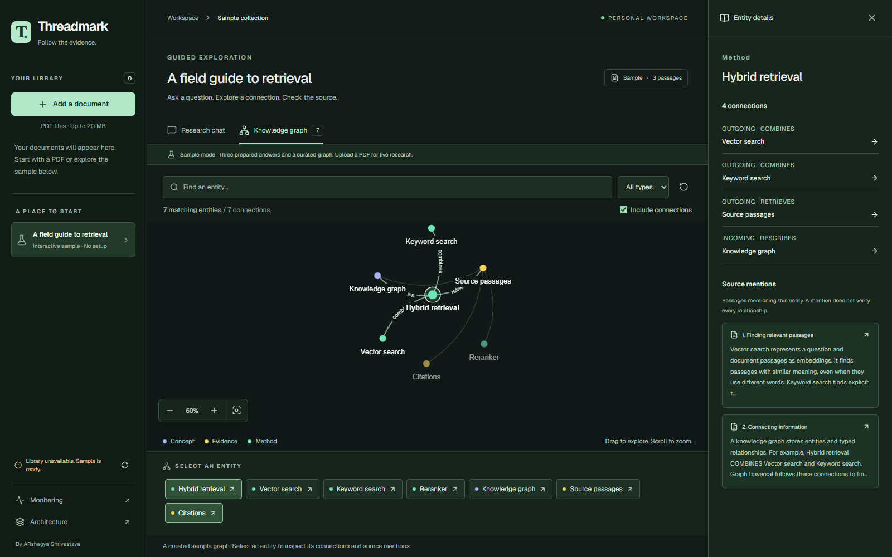
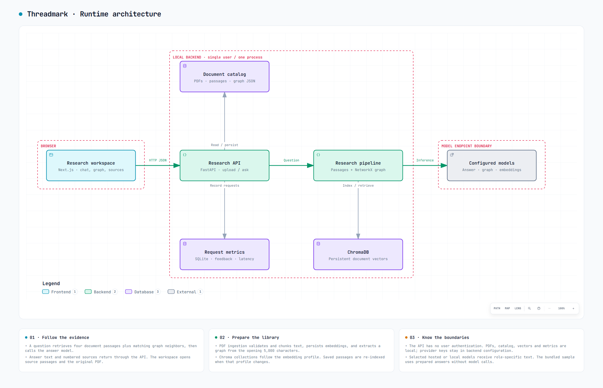

<div align="center">

# Threadmark

### Follow the evidence.

A personal research workspace that connects your documents, questions, and sources.


[Explore](#current-capabilities) · [Try the sample](#sample-mode) · [Run locally](#run-locally) · [Architecture](#runtime-architecture)

</div>



<p align="center"><em>Ask a question. Open a citation. Read the passage behind the answer.</em></p>

Threadmark brings PDF ingestion, conversational question answering, interactive
knowledge graphs, and request monitoring into one workspace. Start with the
bundled sample, then connect your preferred models to research your own documents.

## Current capabilities

| Read with context | Explore connections | Keep control |
| --- | --- | --- |
| Upload PDFs with validation and retry controls. Ask questions and follow clickable passage references to original files. | Search and filter the knowledge graph. Select an entity to inspect directed connections and source mentions. | Keep a local document catalog, choose separate answer/graph/embedding profiles, and inspect request metrics. |

Saved passages are automatically re-indexed when the embedding profile changes.
Graph entities can also be selected with the keyboard.

<details>
<summary><strong>Explore the knowledge graph</strong></summary>



Both screenshots show the bundled educational sample: three prepared answers and a curated graph. No private document or live model response is shown.

</details>

Graph extraction currently covers the opening 5,000 characters. Scanned PDFs
need OCR and are not supported. Source mentions are matched by entity name and
do not automatically verify graph relationships. Chats last for the current
browser session. The local catalog is intended for a single-user, single-process
backend.

## Runtime architecture

The main question path runs from the Next.js workspace through FastAPI and hybrid retrieval to the configured answer model. Document passages and graph neighbors supply context; the API returns the answer with numbered sources. Local stores and model endpoints sit inside explicit trust boundaries.



[Interactive diagram](docs/architecture/runtime-overview.html) · [Editable Archify source](docs/architecture/runtime-overview.architecture.json) · [Code evidence and validation](docs/architecture/README.md)

Download the HTML file and open it in a browser for zoom, theme switching and export. GitHub displays the image above directly.

## Repository layout

```text
Threadmark/
  backend/
    app/                 # FastAPI, ingestion, retrieval, graphs, and metrics
    .env.example
    requirements-dev.txt # Test dependencies, including runtime requirements
    requirements.txt
    models.yaml          # Select model providers, endpoints, and parameters
  frontend/
    src/app/             # Research workspace and monitoring dashboard
    src/components/      # Interactive graph viewer
    src/lib/             # Shared application identity and API configuration
    .env.example
    package.json
```

## Run locally

Use Node.js 22 and Python 3.14 (the versions used by CI). Run npm commands
from `frontend/`; there is no root npm package.

### Backend

From `backend/`, create and activate a Python virtual environment, then run:

```sh
pip install -r requirements.txt
```

Copy `.env.example` to `.env`, then select your chat and embedding profiles in
`models.yaml`. Set credentials for those profiles only. The default profiles use
`NVIDIA_API_KEY`; local Ollama profiles need no API key. See
[model configuration](docs/model-configuration.md) for provider examples. Start the API:

```sh
uvicorn app.main:app --reload --host 127.0.0.1 --port 8000
```

API documentation is available at `http://localhost:8000/docs`.

### Frontend

From `frontend/`, copy `.env.example` to `.env.local`, then run:

```sh
npm ci
npm run dev
```

Open `http://localhost:3000`. `NEXT_PUBLIC_API_URL` defaults to
`http://localhost:8000`. Set it explicitly when using another backend. Public
environment variables are embedded during the frontend build; rebuild after
changing them for production.

## Hosting

Hosting will be configured separately. No deployed application URL is configured
in this repository. Hosted model calls use your selected provider credentials; local model servers
can run without hosted inference. Changing model profiles does not deploy the app.

## License

[MIT](LICENSE). Third-party dependencies retain their respective licenses and notices.

## Sample mode

To explore just the frontend, run `npm ci` and `npm run dev` from `frontend/`, then open `http://localhost:3000`. You can skip backend and model configuration for the sample.

Choose **Try the sample** or the sample document in the library. The three
suggested questions use clearly labelled prepared answers. Graph search,
type filters, source inspection, and the downloadable sample work offline.
Upload your own PDF to use live model-backed questions.

## Validation

Run these checks before opening a pull request. GitHub Actions runs the same
checks on pushes and pull requests.

From `backend/`, with the virtual environment active:

```sh
python -m pip install -r requirements-dev.txt
python -m pip check
python -m pytest tests -q
```

From `frontend/`:

```sh
npm ci
npm run lint
npm run build
```

Tests cover profile validation, provider protocol translation with mocked HTTP/auth,
document retries, and Chroma collection isolation. No provider credentials or paid
inference calls are needed.

## Local files

Environment files, uploaded documents, vector indexes, metrics databases,
dependencies, and build/test caches are excluded by `.gitignore`.
Keep credentials in local environment files and commit only `.env.example`
templates. Local data remains on your machine and is not part of a clone.

Curated documentation screenshots live in [`docs/images/`](docs/images/).

---

Created and maintained by **Arshagya Shrivastava**. See [AUTHORS.md](AUTHORS.md) for attribution.
